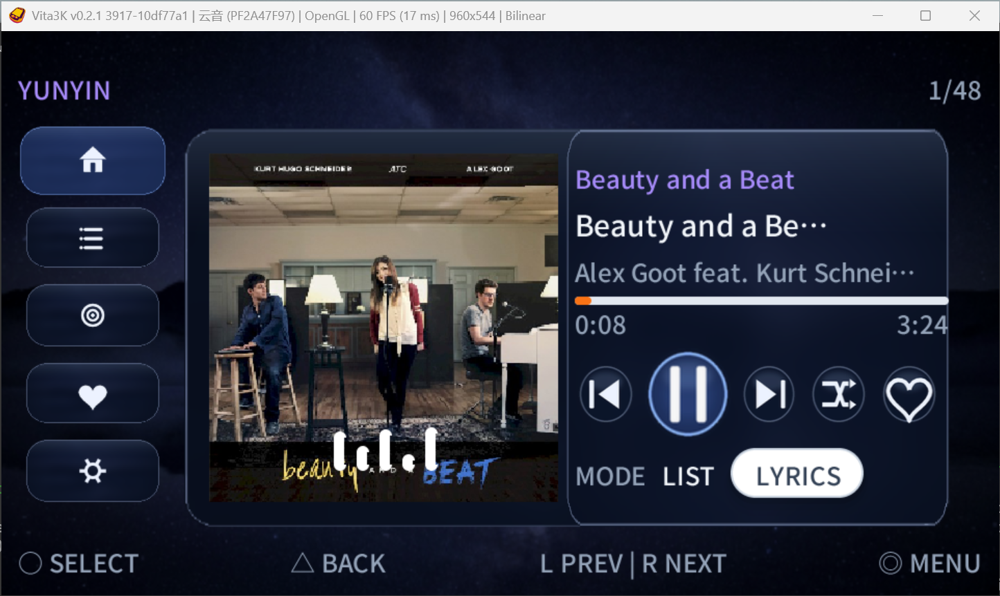
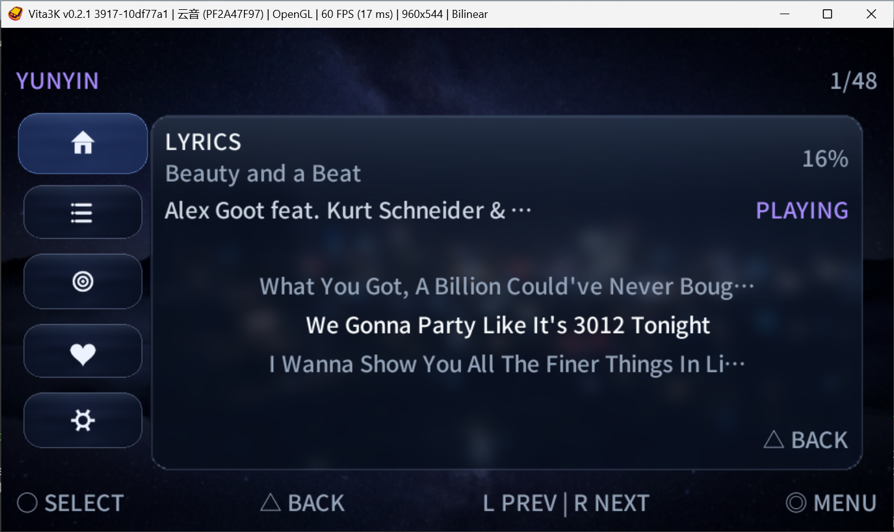
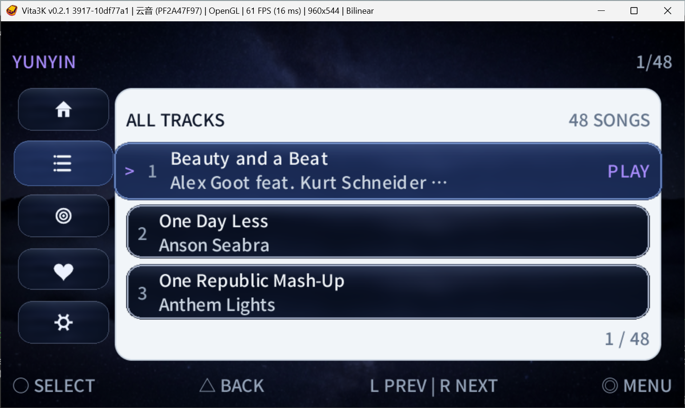
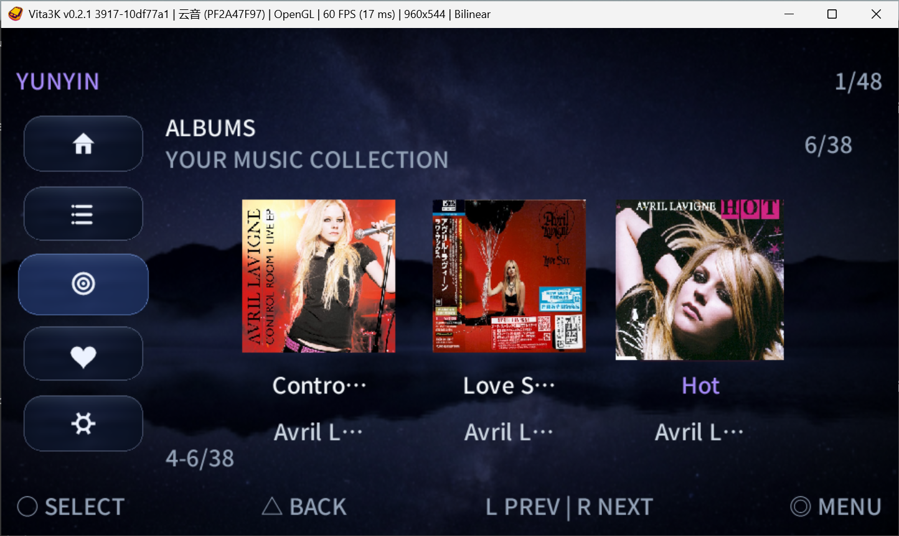
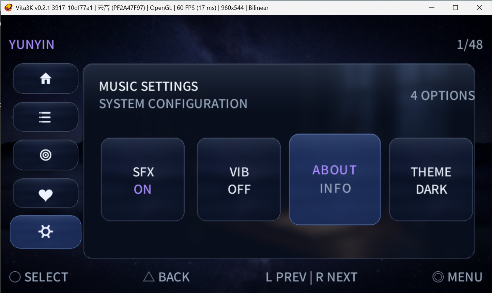

# YUNYIN 云音


一款用 [PocketJS](https://pocketjs.dev) 
（Solid 前端 + Rust ，跑在 Vita 进程里），专为psvita开发的一款本地音乐播放器。

我受不了现有音乐播放器的古法UI，一直想要一个现代化、可自定义主题、支持中文歌词的本地音乐播放器，于是这个项目就诞生了。

|  |  |
| --- | --- |
| 曲库目录 | `ux0:/data/yunyin/music` |
| 音频格式 | MP3（最推荐格式！！） / OGG / WAV / FLAC / OPUS |
| 界面 | 首页播放器 · 全部曲目 · 专辑 · 收藏 · 设置 |
| 主题 | LIGHT / DARK / PURE / ANIME 四套，**默认 DARK** |

> 建议先用 [MusicBrainz Picard](https://picard.musicbrainz.org/) 给音乐补全标签再放进去。
> 歌名、歌手、专辑、封面、歌词全都来自音频内嵌标签，标签越全，界面越好看。

## PSIVTA实机安装

1. 把 `yunyin-cn.vpk`（中文曲库）或 `yunyin-jp.vpk`（日文曲库）用 VitaShell 装到 PS Vita。
2. 音乐放进 `ux0:/data/yunyin/music`（可以分子文件夹，最多 240 首）。
3. 打开「云音」，第一次进入会自动扫描曲库，扫完就能听。
4. 首页按 **○** 播放；**←→** 切按钮/切歌，**△** 返回，**↑↓** 换左侧页面。
5. 设置页可以换主题（LIGHT / DARK / PURE / ANIME）、开关音效和震动。

## 歌名/封面/歌词不显示？用配套工具修

Release 里还有一个 **`YUNYIN-TagCheck.exe`**（Windows，免安装）程序，打开将你mp3文件拖进去，直接调用数据库联网修复你的元数据，治理各种标签不规范：

1. **双击打开** → 把音乐文件夹（或几个文件）**直接拖进窗口**，或点「选择文件夹…」→ 点「开始检查」。
   它会按播放器完全相同的规则读一遍，告诉你每首歌缺什么、哪些是乱码（乱码的还会写出正确内容）。
2. 点 **「联网匹配并修复…」** 一键补全：去 iTunes / Deezer / TheAudioDB / MusicBrainz 搜歌名、歌手、
   专辑、封面，再去 **LRCLIB 找带时间轴的歌词**，一起写进文件里。

   - 结果先列出来给你看，相似度太低的不建议写入（阈值可以自己调整），双击某行还能换下一个候选
   - 默认只补「缺失或乱码」的字段，不动你已经写好的标签
3. 免费库查不到的（翻唱、伴奏、冷门歌）点 **「导出待修文件夹」**，把导出的文件夹拖进 Picard 手动补。

拖错文件了？选中那几行点「**移除选中**」（或按 Delete 键），或者「**清空列表**」重来。

## 不规范标签可能导致出现的情况
| 情况 | 在播放器上的表现 |
| --- | --- |
| MP3 标签编码字节写着 Latin-1，里面却塞 GBK / Big5 字节（国内工具常见） | 中文全变乱码 |
| 只有文件尾那种老式 ID3v1，或者压根没有标签 | 只显示文件名，歌手 `Local`、专辑 `Unknown` |
| 封面不是内嵌的 JPEG / PNG，或体积超过 1MB | 显示默认封面 |

### 自己想自定义写标签时的规范建议

- MP3：ID3v2.3 / 2.4，文字用 **UTF-8**（或带 BOM 的 UTF-16）
- FLAC / OGG / OPUS：Vorbis comment（UTF-8），键名用 TITLE / ARTIST / ALBUM / LYRICS
- 封面：内嵌 JPEG 或 PNG，建议 500×500 以内、**不要超过 1MB**
- 歌词：内嵌（ID3 的 USLT、Vorbis 的 LYRICS），带时间轴更佳（LRC 格式）
- 文件名随意：播放器优先用标签，读不到标签才退回文件名

## 界面截图

**首页播放器**（内嵌封面 + 频谱柱 + 播放控制）



**歌词页**（逐句同步，当前行高亮）



**全部曲目**（序号 / 歌名 / 歌手 / 播放状态）



**专辑**（封面一张张滑动切换）



**设置**（音效 / 震动 / 关于 / 主题）



## 两个字体版本

- `yunyin-cn.vpk` —— 中文优先：Noto Sans SC，汉字用简体字形
- `yunyin-jp.vpk` —— 日文优先：MS Mincho，假名和汉字用日文字形

两个版本界面完全一样，只是字体和字形集不同，按曲库语言挑一个装就行。

## 自行构建

需要 WSL2（`pocket-ubuntu`）里的 VitaSDK、bun 和 PocketJS 源码：

```powershell
# 只打默认版（中文）→ dist/yunyin-main.vpk
wsl -d pocket-ubuntu -u root bash -lc 'cd /mnt/d/AI-PSVITA/yunyin && python3 scripts/build-vpk.py'

# 一次打中文 + 日文两个版本
wsl -d pocket-ubuntu -u root bash /mnt/d/AI-PSVITA/yunyin/scripts/build-variants.sh
```

重新打标签工具：`powershell -ExecutionPolicy Bypass -File scripts\build-tagcheck-exe.ps1`
（需要 Python 3.10+，脚本会自己装 pyinstaller 和 mutagen）

目录：`app/` 前端源码（`app.tsx` 界面、`colors.json` 文字配色）· `asset/ui/<主题>/` 皮肤图 ·
`native/` 音频解码与标签读取 · `fonts/` 字体 · `scripts/` 打包脚本。

## 最后

- 特别感谢pocketjs团队的努力付出！！
- 主题文字颜色在 `app/colors.json` 里改，改完重新打包即可。
- 日文版用的 MS Mincho 来自 Windows 自带字体，对外分发前请确认授权；
  `fonts/chinese/NotoSansSC-Medium.ttf` 是 Noto Sans SC（SIL OFL）。
- 界面参考了 PocketJS 官方 `library` / `gallery` / `music` / `launcher` 模板。


