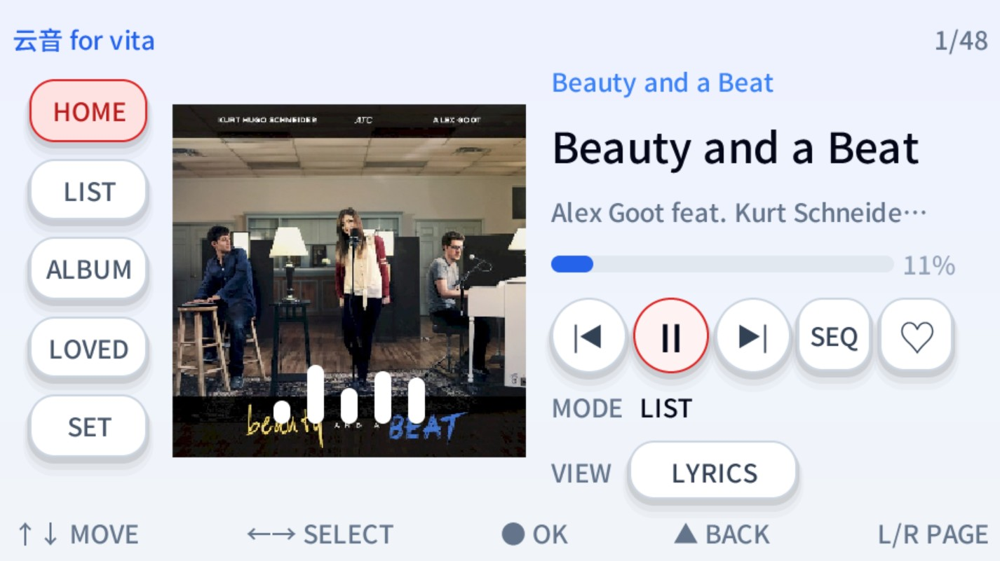
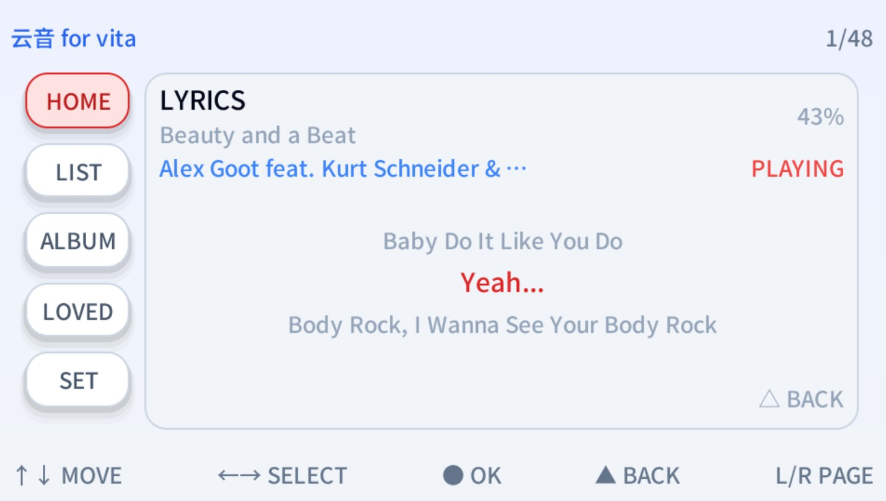
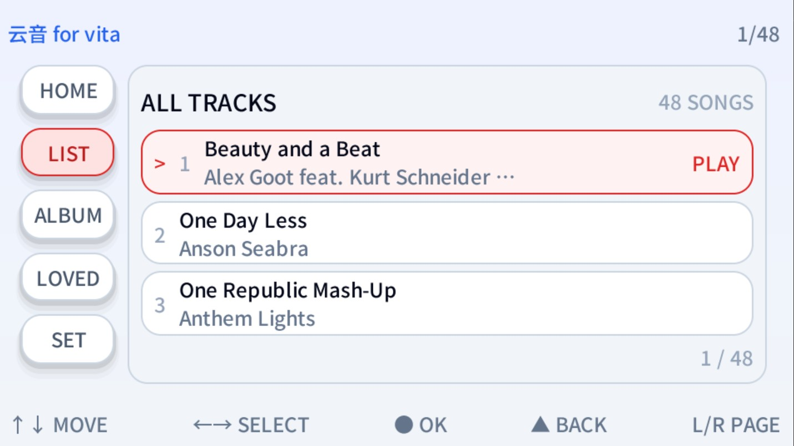
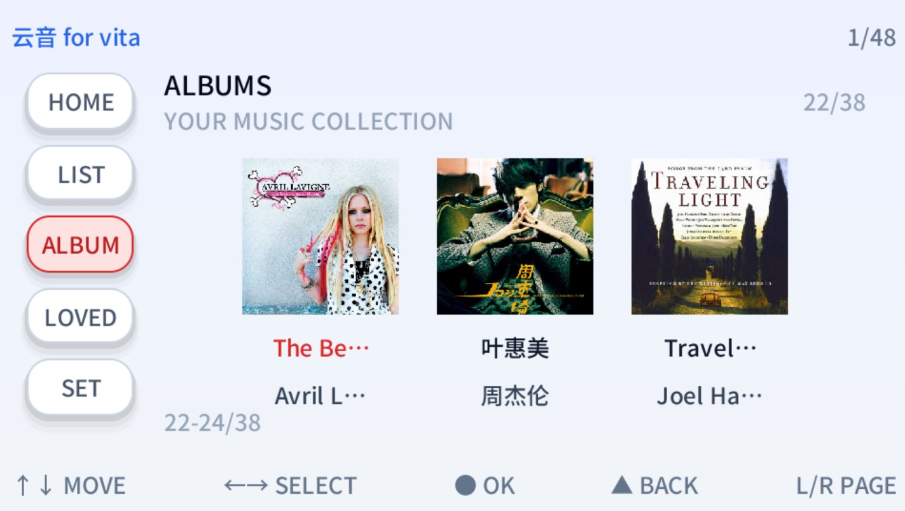
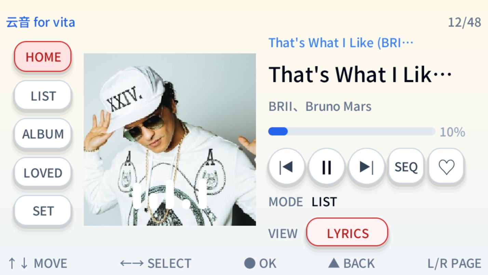

# YUNYIN 云音

一款运行在 **PS Vita** 上的本地音乐播放器，基于
[PocketJS](https://pocketjs.dev)（Solid 前端 + Rust 原生宿主）开发。

注意：强烈推荐音频文件最好通过MusicBrainz Picard进行补充歌曲元数据！！歌曲放在ux0:/data/music/目录下方即可

Musicbraina picard官网：https://picard.musicbrainz.org/

UI 参考 PocketJS 官方
`library` / `gallery` / `music` / `launcher` 模板风格。

## 已知问题

- **wav结尾判定有点问题**：等待更新
- **中文支持不完善，歌词有口口口**：主要是烤出来的字太少了，只有3000个
- **滑动动画有点轻微的卡顿**：等待后续优化动画

## 功能特性

- **本地元数据扫描**：按 `album + title + durationMs` 归类，重命名/重扫不丢收藏；
  空专辑标签归入 `Singles`，去除重复与中文缺字。
- **五大界面**：首页 / 列表 / 专辑 / 收藏 / 设置。
- **本地解码播放**：MP3、OGG、WAV、FLAC、OPUS，不过后面的无损格式压力比较大
- **内嵌专辑封面**：从歌曲元数据提取封面并懒加载；专辑卡片封面随可见专辑实时刷新，
  左右切换带滑动动画，一张一张地换。
- **CJK 字体**：Noto Sans SC 所有字重烘焙进字体图集，中文标题/歌手/专辑名不糊不清。
- **底部提示**：针对 Vita 按键（↑↓ 左侧区、←→ 右侧区、○ 确定、△ 返回、L/R 切换）。

## 界面截图

首页播放器（专辑封面 + 播放控制 + 进度 + 律动条）：



歌词页（逐句同步、上下滚动）：



列表页（全部曲目）：



专辑页（封面网格，懒加载即时刷新 + 左右滑动切换动画）：



首页播放器（另一首歌 / 另一主题）：



## 打包方法

PowerShell：

```powershell
wsl -d pocket-ubuntu -u root bash -lc 'cd /mnt/d/AI-PSVITA/yunyin && python3 scripts/build-vpk.py'
```

输出：`dist/yunyin-main.vpk`（TITLE_ID: `PF2A47F97`）。
发布版另存为 `release/YUNYIN-v0.1.0.vpk`。

构建依赖（在 WSL2 `pocket-ubuntu` 发行版内）：
- VitaSDK（`/opt/vitasdk`）
- bun（`/root/.bun/bin/bun`）
- PocketJS 框架（`/root/pocketjs`）
