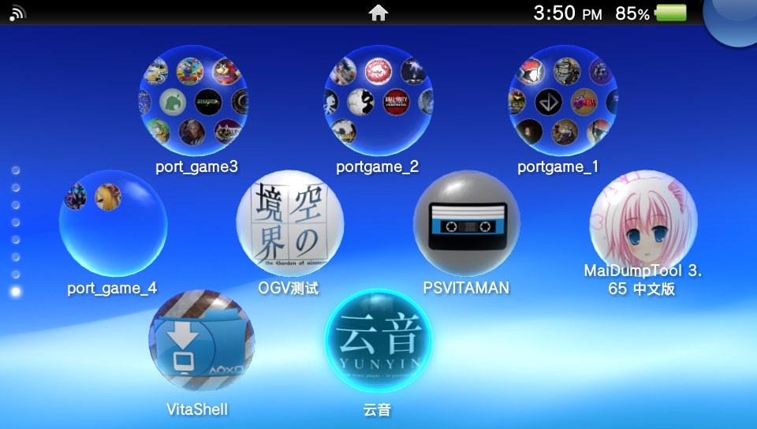
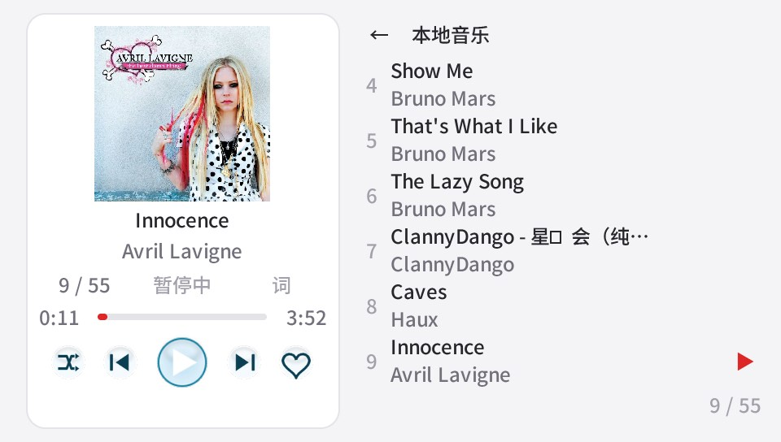
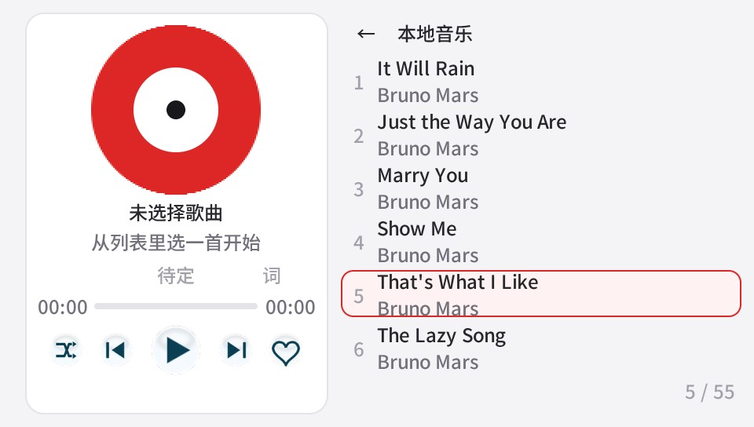

# YUNYIN 云音 · PS Vita 音乐播放器

**本地曲库 + 网易云在线**两套来源的音乐播放器，跑在 PS Vita 上
（PocketJS 0.13 宿主 + Rust/C 原生层 + SolidJS 界面）。
扁平化界面、五套配色、扫码登录、流式字库、环形磁盘缓存、断网可用的在线清单。

```
┌─ 左：常驻播放器卡片 ─┬─ 右：四个页签（发现 / 榜单 / 歌单 / 我的）+ 子页 ─┐
│  封面 · 状态 · 词     │  列表（虚拟滚动）· 焦点指示 · 来源分栏            │
└──────────────────────┴───────────────────────────────────────────────────┘
```

> 当前版本 **1.10**（`param.sfo` 里的 `APP_VER=01.10`）。
> 安装包见 [Releases](../../releases)。

## 界面

> 真机截图（PS Vita，960 × 544）。

**桌面气泡与启动画面** —— LiveArea 图与启动画面随包发布，装完就在桌面上：




**本地曲库** —— 左边是常驻播放器卡片（内嵌封面、进度、状态词、播放控制排），
右边是列表（虚拟滚动 + 焦点指示，右下角 `9 / 55` 是当前清单进度）：



**待机状态** —— 还没选歌时封面位显示占位图、状态是 `待定`、进度 `00:00`，
从列表里选一首才开始播放：



## 上手（4 步）

1. 用 VitaShell 装 `yunyin-main.vpk`。
2. 把音乐放进 `ux0:/data/yunyin/music/`（可分子文件夹，支持 **mp3 / m4a / ogg / wav / flac / opus**，
   内嵌封面与歌词会被读出来）。
3. 想听在线歌：**我的 → 账号**，用网易云 App 扫码登录。
4. 〔可选但强烈建议〕在 `ux0:/data/yunyin/` 建一个**空文件** `debug` —— 打开日志，
   出问题时 `yunyin.log` 就是唯一证据（不建不写，不影响性能）。

在线歌单**不用手动准备**：每次启动应用会在后台把热门推荐 / 每日推荐 / 我的歌单 /
四个榜单写成 JSON 落到 `ux0:/data/yunyin/list/`，界面直接读文件 —— 断网也能看上次的内容。

## 功能

| 能力 | 状态 |
| --- | --- |
| 本地六格式播放（mp3 / m4a / ogg / wav / flac / opus） | ✅ |
| 内嵌封面、内嵌歌词（含逐字高亮） | ✅ |
| 在线播放（Range 流 + 滚动预读 + 秒级缓冲 Gate） | ✅ |
| 磁盘缓存（固定 32 MB `cache.dat` 环形覆盖，正常播放不删文件） | ✅ |
| 下一首预取（网络空闲时才跑，按键期间让路） | ✅ |
| 扫码登录 / 我的歌单 / 每日推荐 / 四个榜单 | ✅ |
| 在线清单落盘（断网可看，事件驱动刷新） | ✅ |
| 收藏（本地 / 在线分组）、专辑页、歌词页、设置页 | ✅ |
| 字库：内置烘焙 + 流式（29,894 字，可切换） | ✅ |
| 五套扁平化主题（浅色 / 深色 / 浅蓝 / 浅绿 / 浅紫） | ✅ |
| 在线歌封面 / 搜索 | ❌ 未做 |

## 按键

| 键 | 作用 |
| --- | --- |
| ↑ ↓ | 列表上下；列表顶部再按 ↑ 聚焦返回/页签行 |
| ← → | 页签之间切换 / 从列表回到播放器 / 播放器里移动焦点 |
| ○ | 确认（播放、进子页、切主题、切字库…） |
| △ | 返回上一层 / 回到当前歌单第一首 |
| L / R | 上一首 / 下一首（息屏也有效） |
| START | 息屏继续播放（再按或任意键回来） |
| PS | 播放期间锁定（先暂停才能退出） |

播放器控制排（左→右）：**顺序模式 · 上一首 · 播放/暂停 · 下一首 · 喜爱**（播放/暂停恒在正中）。
信息行是「清单进度（2 / 6）· 状态 · 词（歌词页）」，进度条那行在最下面。

## 状态词

信息行中间那格按优先级显示（都是短词，详细原因在日志里）：

| 状态 | 含义 |
| --- | --- |
| `待定` | 还没选歌 |
| `播放中` / `暂停中` | 正常播放状态 |
| `缓冲中` | 在线歌已按下、还没出声（呼吸动画是编译期烘好的 keyframe，不吃 JS） |
| `无网络` | 等了 20 秒还没出声 |
| `网络故障` / `需要会员` / `无版权` / `需要登录` | 打开失败（`需要会员` 的条目在列表里标灰，切歌时自动跳过） |

## 卡里的数据（`ux0:/data/yunyin/`）

```text
ux0:/data/yunyin/
├── music/              本地曲库
├── list/               在线清单 JSON（应用自动生成、自动刷新）
├── playlist.json       〔可选〕自己写的在线歌单
├── cache.dat           在线歌磁盘缓存（固定 32 MB 环形覆盖，可随手删）
├── cache.idx           缓存索引（自动维护）
├── store/              收藏 / 字库模式 / 登录会话
├── covers/             封面解码缓存（可随手删）
├── yunyin.log          运行日志（建了 debug 才写）
├── debug               〔开关〕建了才写日志
├── netdbg              〔开关〕建了才记 HTTP 逐条轨迹
└── cookie.txt          〔可选〕手填会话（模拟器/扫码走不通时的后门）
```

应用**不起任何服务、不监听端口**，所有文件都在这一个文件夹里。

## 自行构建

在 WSL2（Ubuntu）里准备 **VitaSDK**、**bun**、**PocketJS 0.13 源码检出**：

```bash
# 1) 类型检查（打包器只转译不查类型，这道闸专抓真机才炸的错）
bash scripts/typecheck-app.sh

# 2) 宿主侧测试（加密向量 / JSON / 环形缓存 / 缓冲策略；不需要 Vita）
cd tests && cargo test; cd ..

# 3) 打包 → dist/yunyin-main.vpk
POCKETJS_ROOT=/root/pocketjs013 YUNYIN_BARE_GRAPHICS=1 python3 scripts/build-vpk.py
```

* `YUNYIN_BARE_GRAPHICS=1`：跳过与 0.13 渲染模型冲突的两组图形补丁，**正式包必须带**。
* 常用开关：`YUNYIN_FONT=chinese|japanese`、`YUNYIN_THEME=light|dark|pure|anime`、
  `YUNYIN_OUT=<名字>`、`YUNYIN_APP_VER=01.10`。
* **不要**加 `YUNYIN_CATCH_HANG`：0.13 的看门狗会在单帧超 2 秒时打死 guest。
* 源码里没有三个构建派生物，构建时自动生成：`app/theme-seed.tsx`（由 `colors.json`）、
  `app/images.json`（扫 `asset/**`）、`fonts/*/cjk.pjfa`（流式字库归档）。

## 仓库结构

```text
.
├── app/          界面层：app.tsx（唯一入口）+ core/ + pages/ + components/ + sce_sys/
├── native/       原生层：rs/（Rust）+ audio/ host/ net/（C）+ vendor/ + libs/
├── asset/        主题素材（构建时复制成应用内的 asset/）
├── fonts/        字体与流式字库字符集（chinese/、japanese/）
├── scripts/      构建与检查：build-vpk.py + yunyin_build/ + gen-cjk-charset.py
│   └── tools/    素材/曲库维护工具（不参与构建）
├── tests/        宿主侧 cargo 测试
└── docs/         技术文档（只有两份）+ img/ 真机截图
```

| 文档 | 内容 |
| --- | --- |
| [docs/架构.md](docs/架构.md) | 模块地图、数据流、缓冲策略、字库、构建流水线、**不变量** |
| [docs/排障.md](docs/排障.md) | 日志关键字、崩溃符号化、常见故障对照、踩过的坑 |

## 主题与素材

五套扁平化配色：浅色 / 深色 / 浅蓝 / 浅绿 / 浅紫（设置页「主题」按 ○ 轮换）。
播放器控制键用素材 PNG（每个动作常态 / 聚焦两张，聚焦态自带圆圈高亮），每套主题一套图。
加新颜色不用手抄调色板：

```bash
python3 scripts/tools/gen-flat-themes.py     # 从浅色派生配色（改脚本里的 THEMES 表）
python3 scripts/tools/gen-theme-icons.py     # 从浅色图标派生一套换色图标
```

## 致谢

* [PocketJS](https://pocketjs.dev)：PS Vita/PSP 上的 JS+原生应用运行时（宿主、GXM 渲染、字库归档）。
* [VitaSDK](https://vitasdk.org)：工具链与 `Sce*` 头/桩。
* mpg123 / libvorbis / opusfile / dr_wav：解码。
* [Noto Sans SC](https://fonts.google.com/noto) / MS Mincho：界面字体（各自的许可证随字体）。
